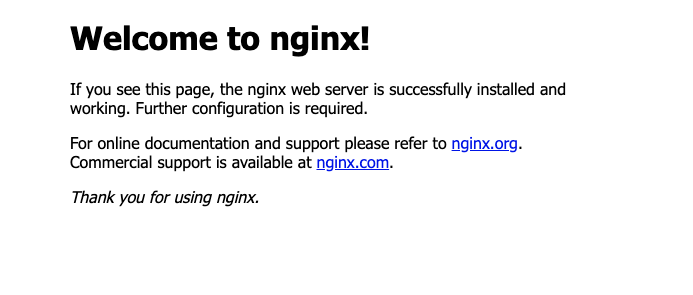

# Nginx 简易教程

## 介绍

Nginx 是一个轻量级别的 web 服务器/反向代理服务器，特点是 内存占有量少，并发能力强，事实上nginx的并发能力确实在同类型的网页服务器中表现较好，中国大陆使用nginx网站用户有：百度、京东、新浪、网易、腾讯、淘宝等

## 安装

### mac

1. 安装Command Line tools 
    `xcode-select --install`
2. 安装brew 
    `ruby -e "$(curl -fsSL https://raw.githubusercontent.com/Homebrew/install/master/install)"`
3. 安装nginx 
    `brew install nginx`
4. 启动nginx 
    `sudo nginx`

### windows

1. http://nginx.org/en/download.html 下载稳定版本 解压
2. 双击 nginx.exe 
   
==mac默认端口为8080，windows默认端口为80，如果启动不起来请检查是否端口冲突==

==mac默认安装路径为/usr/local/etc/nginx==
==mac与windows 路径不同 配置是一样的，本文以mac为例子，win需要找到 nginx的 nginx.conf文件==

浏览器访问  mac localhost:8080; windows localhost:80  如果看到 nginx的欢迎页面即安装成功

;

## 基本配置介绍

1. 查看 nginx.conf 配置文件  
   `cat /usr/local/etc/nginx/nginx.conf`
2. 参数大致介绍
    ```nginx
    user root owner;  这里是设置允许访问的 用户  nginx报错 出现 403 forbidden  错误 请修改此处
    worker_processes  1;  开启进程数 <= CPU数

    错误日志保存的位置
    #error_log  logs/error.log;
    #error_log  logs/error.log  notice;
    #error_log  logs/error.log  info;

    进程号保存文件
    #pid        logs/nginx.pid;

    
    每个进程最大连接数（最大连接=连接数x进程数）每个worker允许同时产生多少个链接，默认1024
    events {
        worker_connections  1024;
    }


    http {
        文件扩展名与文件类型映射表
        include       mime.types;
        默认的文件类型
        default_type  application/octet-stream;

        日志文件输出的格式 这个位置是全局设置
        #log_format  main  '$remote_addr - $remote_user [$time_local] "$request" '
        #                  '$status $body_bytes_sent "$http_referer" '
        #                  '"$http_user_agent" "$http_x_forwarded_for"';

        请求日志的保存位置
        #access_log  logs/access.log  main;

        打开发送文件
        sendfile        on;
        #tcp_nopush     on;

        #keepalive_timeout  0;
        连接超时时间
        keepalive_timeout  65;

        打开gzip压缩
        #gzip  on;

        配置负载均衡 服务器列表
        upstream test {
            #weigth参数表示权值，权值越高被分配到的几率越大
            #max_fails 当有#max_fails个请求失败，就表示后端的服务器不可用，默认为1，将其设置为0可以关闭检查
            #fail_timeout 在以后的#fail_timeout时间内nginx不会再把请求发往已检查出标记为不可用的服务器
            server 49.232.229.120;
            server 10.120.133.10;
        }
        配置虚拟主机，基于域名、ip和端口
        server {
            监听端口给
            listen       8080;
            监听域名
            server_name  localhost;

            #charset koi8-r;
            nginx访问日志
            #access_log  logs/host.access.log  main;

            location / {

                返回根路径地址（相对路径：相对于/usr/local/nginx/）
                root html; 
                默认访问文件
                index index.html index.htm;
                负载均衡反向代理
                proxy_pass http://test; //这里的test即是上面负载均衡的服务器列表的key
            }
            #location /test/ {
                # root   html;
                #  alias /Users/richard/Desktop/demo/;
                #  index  index.html index.htm;
                #  proxy_pass http://len;
            #}

            #error_page  404              /404.html;

            # redirect server error pages to the static page /50x.html
            #
            #错误页面及其返回地址
            error_page   500 502 503 504  /50x.html;
            location = /50x.html {
                root   html;
            }

            # pass the PHP scripts to FastCGI server listening on 127.0.0.1:9000
            #
            #location ~ \.php$ {
            #    root           html;
            #    fastcgi_pass   127.0.0.1:9000;
            #    fastcgi_index  index.php;
            #    fastcgi_param  SCRIPT_FILENAME  /scripts$fastcgi_script_name;
            #    include        fastcgi_params;
            #}

            # deny access to .htaccess files, if Apache's document root
            # concurs with nginx's one
            #
            #location ~ /\.ht {
            #    deny  all;
            #}
        }


        # another virtual host using mix of IP-, name-, and port-based configuration
        #
        #server {
        #    listen       8000;
        #    listen       somename:8080;
        #    server_name  somename  alias  another.alias;

        #    location / {
        #        root   html;
        #        index  index.html index.htm;
        #    }
        #}


        # HTTPS server
        #
        #server {
        #    listen       443 ssl;
        #    server_name  localhost;

        #    ssl_certificate      cert.pem;
        #    ssl_certificate_key  cert.key;

        #    ssl_session_cache    shared:SSL:1m;
        #    ssl_session_timeout  5m;

        #    ssl_ciphers  HIGH:!aNULL:!MD5;
        #    ssl_prefer_server_ciphers  on;

        #    location / {
        #        root   html;
        #        index  index.html index.htm;
        #    }
        #}
        include servers/*;
    }
    ```

## 简易的http服务

上面其实 我们已经启动了一个http服务，只不过它访问的是 nginx默认的文件夹 /usr/local/etc/nginx/html

但是实际情况下，我们需要访问的是我们自己的工程目录

这个时候只需要配置一下即可 server中配置一个监听

在桌面建立一个demo文件夹这就是我们的工程，里面在新建一个index.html
```
localhsot /demo/ {
    alias /Users/richard/Desktop/demo/; 工程目录
}
```

这个时候 浏览器访问http://localhost:8080/demo/index.html 即可访问 我们工程目录里的文件了

## 反向代理与负载均衡的配置

### 什么是反向代理

说反向代理之前，我们先看看正向代理，正向代理也是大家最常接触的到的代理模式，我们会从两个方面来说关于正向代理的处理模式，分别从软件方面和生活方面来解释一下什么叫正向代理

在如今的网络环境下，我们如果由于技术需要要去访问国外的某些网站，此时你会发现位于国外的某网站我们通过浏览器是没有办法访问的，此时大家可能都会用一个操作FQ进行访问，FQ的方式主要是找到一个可以访问国外网站的代理服务器，我们将请求发送给代理服务器，代理服务器去访问国外的网站，然后将访问到的数据传递给我们！

上述这样的代理模式称为正向代理，正向代理最大的特点是客户端非常明确要访问的服务器地址；服务器只清楚请求来自哪个代理服务器，而不清楚来自哪个具体的客户端；正向代理模式屏蔽或者隐藏了真实客户端信息。

个人理解：  首先不能有一个错误的认知，正向代理与反向代理并不是互斥的关系，他们描述的是两个过程， 正向代理指的是客户端与代理服务器之间的过程，而反向代理指的是代理服务器与服务端之间的过程

而在反向代理的过程中，当用户数量大的时候，并发量高的时候，这个时候我们就需要负载均衡策略来处理这个问题

### 负载均衡的配置

1. 负载均衡的服务器列表
    ```
    upstream key {
        //ip_hash机制能够让某一客户机在相当长的一段时间内只访问固定的后端的某台真实的web服务器,这样会话就会得以保持,
        //web服务器之间跳来跳去了,也不会出现登录一次的网站又提醒重新登录的情况.
        //ip_hash;
        server XX.XXX.XXX.XXX;
        server XX.XXX.XXX.XXX; //ip 地址  
    }
    ```

2. 配置一个监听
   ```
    location /test/ {
        proxy_pass http://key;
    }
   ```

## SSI技术

### 概念；
SSI：Server Side Include，是一种基于服务端的网页制作技术，大多数（尤其是基于Unix平台）的web服务器如Netscape Enterprise Server等均支持SSI命令。

它的工作原因是：在页面内容发送到客户端之前，使用SSI指令将文本、图片或代码信息包含到网页中。对于在多个文件中重复出现内容，使用SSI是一种简便的方法，将内容存入一个包含文件中即可，不必将其输入所有文件。通过一个非常简单的语句即可调用包含文件，此语句指示 Web 服务器将内容插入适当网页。而且，使用包含文件时，对内容的所有更改只需在一个地方就能完成。

白话文： html 文档写个特殊的注视，这个东西把这段注释替换成你想要的东西，对于公共头，公共尾，有显著效果

### nginx 配置

```
ssi on;

ssi_silent_errors on;

ssi_types text/shtml;
```
可以写到第一个server段的前面，也可以写到server里面


用法：

在html文件中 ，<!— #include file=“文件名” —> 或者 <!— #include virtual=“文件名” —>

区别：

file 只支持同级目录和下级目录。不支持向上查找
virtual  是一个虚拟的项目目录  站点名就是根目录

